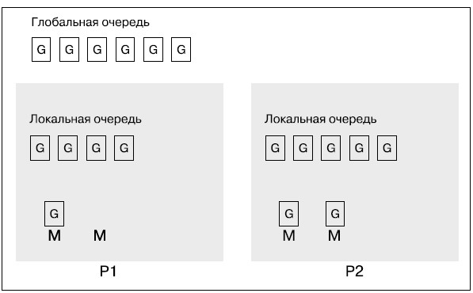

Планировщик отвечает за эффективное распределение работы, которую следует выполнить, между доступными ресурсами.Go работает с использованием планировщика m:n (или планировщика M:N). Планировщик Go оперирует горутинами, которые легче потоков ОС, используя при этом потоки ОС.

В Go используется модель конкурентности fork-join. Слово fork (вилка) в названии модели говорит о том, что дочерняя ветвь может быть создана в любой точке программы. Аналогично слово join («объединение») говорит о том, что в некоторой точке дочерняя ветвь заканчивается и объединяется с родительской. Точками такого объединения, в частности, являются операторы sync.Wait() и каналы, которые собирают результаты выполнения горутин, тогда как каждая новая горутина создает дочернюю ветвь.

Стратегия справедливого планирования довольно проста концептуально и имеет простую реализацию. Согласно этой стратегии, вся нагрузка должна равномерно распределяться между доступными процессорами. Поначалу такая стратегия может показаться идеальной, поскольку приходится учитывать не так уж много нюансов, при этом сохраняя одинаковую нагрузку всех процессоров. Однако на поверку оказывается, что это не совсем так, поскольку большинство распределенных задач обычно зависят друг от друга, из-за чего некоторые процессоры оказываются недостаточно загружены, или, что то же самое, одни процессоры используются интенсивнее, чем другие.

Горутина в Go — это задача, а все, что происходит после вызова горутины, является продолжением. В стратегии перехвата работы, используемой планировщиком Go, недостаточно загруженный (логический) процессор ищет дополнительную работу, которую выполняют другие процессоры. Найдя такие задания, он перехватывает их у другого процессора или нескольких процессоров — отсюда и название. Кроме того, алгоритм перехвата работы в Go перехватывает продолжения и ставит их в очередь. Останавливающее соединение, как следует из названия, — это место, в котором поток выполнения останавливается в точке соединения и начинает искать себе другую работу.

Несмотря на то что и при перехвате задач, и при перехвате продолжений имеет место останавливающее соединение, продолжения случаются чаще, чем задачи; поэтому алгоритм Go работает не с задачами, а с продолжениями.

Основным недостатком перехвата продолжений является то, что это требует от компилятора языка программирования дополнительной работы. К счастью, язык Go предоставляет эту дополнительную возможность, и поэтому в его алгоритме перехвата работы используется алгоритм перехвата продолжений.

Одним из преимуществ перехвата продолжений является то, что он дает одинаковые результаты при использовании функций вместо горутин или одного потока с несколькими горутинами. Это закономерно, так как в каждый момент в обоих случаях выполняется только что-то одно.

Теперь вернемся к используемому в Go алгоритму планирования m:n. Строго говоря, в у нас всегда есть m горутин, которые выполняются и, следовательно, запланированы для запуска в n потоках ОС, использующих не более GOMAXPROCS логических процессоров.

Планировщик Go работает с использованием трех основных типов сущностей:потоков ОС (M), которые связаны с используемой операционной системой, горутин (G) и логических процессоров (P). Количество процессоров, которые могут использоваться программой Go, определяется значением переменной среды GOMAXPROCS: в любое время число процессоров не может превышать GOMAXPROCS.

существует два вида очередей: глобальная и локальная, причем каждая локальная очередь присоединена к соответствующему логическому процессору. Горутины из глобальной очереди назначаются очередям логических процессоров, где они и выполняются. Таким образом, планировщик Go должен проверить глобальную очередь, чтобы избежать выполнения горутин, расположенных только в локальной очереди какого-либо из логических процессоров. Однако планировщик не проверяет глобальную очередь постоянно. Следовательно, у глобальной очереди нет преимуществ по сравнению с локальной

Кроме того, каждый логический процессор может иметь несколько потоков и возможен перехват между локальными очередями доступных логических процессоров. Имейте в виду, что планировщик Go может при необходимости создавать дополнительные потоки ОС. Однако потоки ОС весьма затратны, поэтому слишком активные действия с ними могут замедлить работу приложений Go.

Помните, что использование большего количества горутин в программе не панацея для повышения производительности, так как большое количество горутин в сочетании с многочисленными вызовами sync.Add(), sync.Wait() и sync.Done() может замедлить работу программы из-за дополнительных обслуживающих операций, которые должен выполнять планировщик Go.