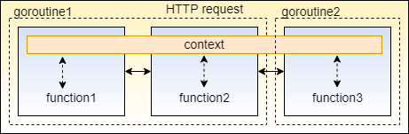

=== When Do We Use Context?

As the name suggests, we use the context package whenever we want to pass around “context”, or common scoped data within our application. For example:

- Request IDs for function calls and goroutines that are part of an HTTP request call
- Errors when fetching data from a database
- Cancellation signals whe performing async operations using goroutines

Using the Context data type is the idiomatic way to pass information across these kind of operations, such as:

- Cancellation signals to terminate the operation
- Miscellaneous data required at every function call invoked by the operation
